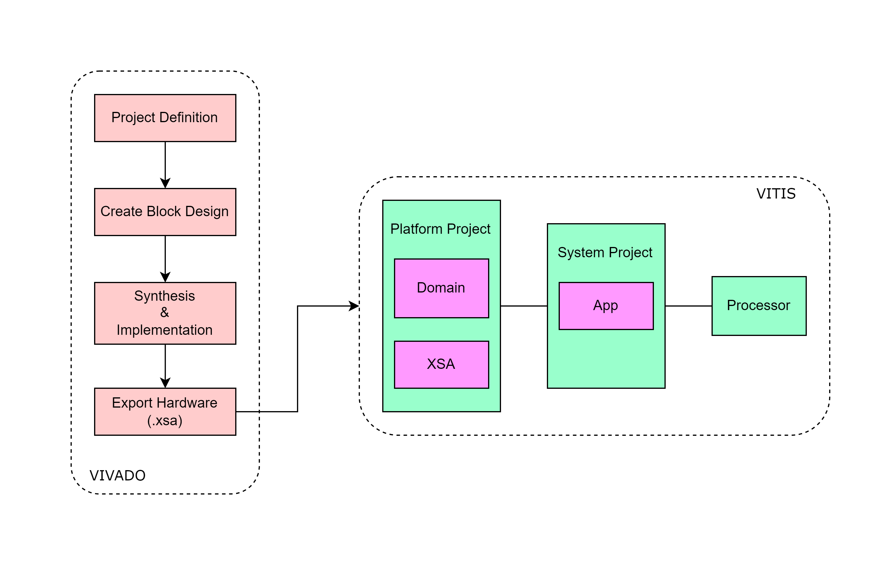
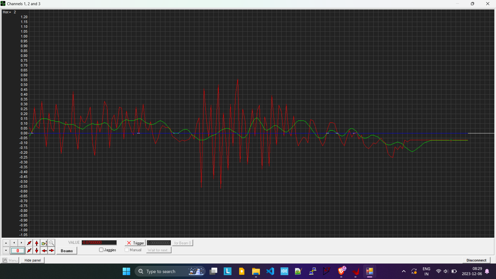

# zynq_sensor_fir_demo
Demonstrating the sensor interface through SPI IP with Zynq 7000 SoC using the block design method and implementation of FIR filter in the processor core.

<p align="left">
  
</p>

## tree 
```
│
├───images
│       filter_in_action.png
│       tool_flow_bd.png
│
├───vitis
│       Filter.c
│       Filter.h
│       main.c
│       pmod_nav.c
│       SPI.c
│       SPI.h
│
└───vivado
        design_1.bda
        design_1.xdc
        design_1_wrapper_sensors.xsa
```

## Usage

1. Create a new vivado projet and add the `design_1.xdc` which is a constraints file for the Pmod NAV used in this project. If using the same, copy or else this needs to be mapped custom for your sensor peripheral.

2. Refer to the block design from the `design_1.bda` file.

3. Go to `File -> Export -> Hardware File` which essentially gives the `design_1_wrapper_sensors.xsa`. If you want to experiment around the Vitis platform only, take this as your portable platform for the Vitis project creation.

4. Import all the source and header files to your Vitis source folder. The project is generalized for implementing FIR, IIR, Moving Average filters. Choose the required filter from the `Filter.h` through the compile time switcher defined. The existing code calls the `NavDemo_Run();` in the main loop that prints the data into serial terminal which is in the `pmod_nav.c` file through `FIRFilter_Update(&lpfAcc, nav.acclData.X);` and `printf("%.2f,%.2f\n",nav.acclData.X,lpfAcc.out);` calls. You may want to overlook this and use the function as per the requirement.

## Result

|Legend			|	          |
|-----------|-----------|
|Red		    |Green		  |
|Unfiltered	|Filtered	  |

<p align="left">
  
</p>

#### Reach out to us at DevHeads community for any support!
